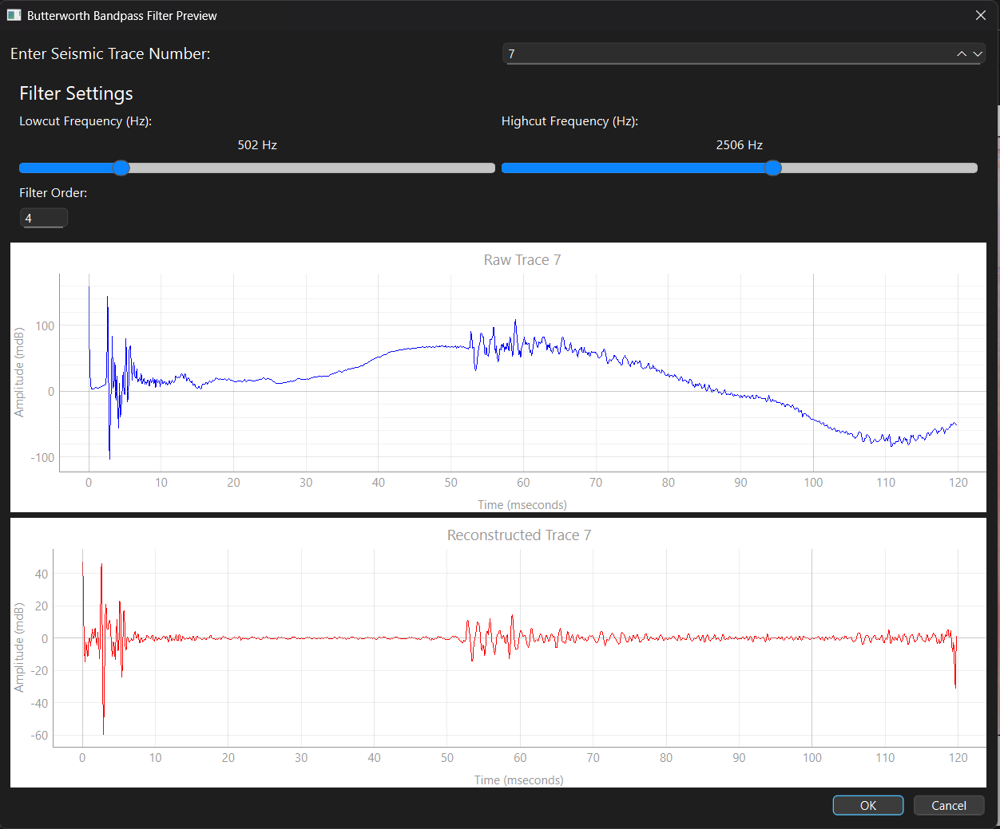

# QGeoMarine

**A Modular Python GUI for Seismic and Magnetic Data Processing from Marine Geophysical Surveys**  
🚧 *This project is currently under active development.*


QGeoMarine is a modular, cross-platform application built in Python for the interactive processing, visualization, and interpretation of geophysical data collected from marine surveys. It supports workflows involving seismic (e.g., Sub-Bottom Profiler/Chirp) and magnetic datasets in commonly used formats (e.g., SEG-Y, CSV).

Designed for researchers, students, and professionals in marine geoscience, QGeoMarine provides a rich GUI that integrates scientific libraries with interactive PyQt6-based tools.

---

## 🚀 Features

- 📁 Project Manager with recent file tracking
- 🧭 Navigation parsing from SEG-Y or external ship logs
- 🎚️ Seismic signal processing (Gain, Mute, Filter, Deconvolution)
- 🧠 Advanced analysis (Periodogram, Wavelet Transform, Instantaneous Attributes)
- 🧰 Editable magnetic data tables with SQLite backend
- 🗺️ Interactive map display using folium and survey line plotting
- 📊 Synthetic wavelet modeling and interactive trace synthesis
- ✍️ Interactive horizon picking, annotation, and export tools

---

## 🧱 Application Structure

| Module                | Purpose |
|------------------------|---------|
| `Main.py`             | Core launcher and project workspace management |
| `UI.py`               | PyQt6 UI classes (Intro screen, dialogs, editors). All UI classes need to be migrated here |
| `datahandling.py`     | Seismic/magnetic data I/O, SQLite integration |
| `Navigation.py`       | Ship GPS and towfish position calculators |
| `Gains.py`            | AGC, TVG, constant gain functions for signal enhancement |
| `Filters.py`          | Methods for signal filtering analysis |
| `Mute.py`             | Manual and automatic trace muting |
| `Deconvolution.py`    | Modular signal deconvolution methods (e.g., Predictive, Spiking Deconvolution) |
| `Trace_analysis.py`   | Frequency and time-frequency trace analytics |
| `Plots.py`            | Modular Matplotlib-based plotting functions |
| `Interpretation.py`   | Seismic GUI for horizon picking and annotation. Future plans for deep learning modules (CNNs) for geological feature extraction |
| `Maggy_Editor.py`     | Magnetic data visual editor, filters, channel math. Future plans for grid generation and AI modules for magnetic anomally detection |
| `Maps.py`             | Raster/vector GIS overlays, interactive survey line mapping |
| `Seismic_Editor.py`   | GUI for seismic data editing, plotting, interpretation |

---

🧩 *Julia integration planned*

To accelerate heavy numerical tasks, QGeoMarine includes Julia modules for future integration:

- **`filters.jl`**  
  Contains optimized IIR and FIR filters using `DSP.jl` and `Wavelets.jl`.  
  Features include Butterworth, Chebyshev, FIR window filters, F-K domain filters, and wavelet denoising.

- **`Plots.jl`**  
  Built with `Makie.jl` for high-performance plotting of seismic traces, periodograms, spectrograms, wavelet transforms, and full seismic sections.

These modules and other that are under developement will be linked into the Python GUI using [`PyJulia`](https://pyjulia.readthedocs.io/) or subprocess and **replace the corresponding Python modules** bridging to offload computationally intensive routines.

> 🧩 Goal: Seamlessly switch between Python and Julia backends for faster heavy computing tasks resulting in a lightweight faster application.

---

---

## 🧠 Machine Learning Extensions (Planned)

Future releases of **QGeoMarine** will integrate machine learning models to enhance interpretation and automation in marine geophysical workflows. These developments aim to assist users in detecting features, reducing manual interpretation time, and extracting deeper insights from large datasets.

### 🔹 Magnetic Data
- **Magnetic Anomaly Detection**  
  Leverage unsupervised learning (e.g., Isolation Forests, Autoencoders) to detect subtle or unusual magnetic anomalies, especially in noisy environments.
  
- **Target Classification**  
  Train classifiers (e.g., Random Forests, CNNs) to distinguish anomaly sources such as UXOs, pipelines, shipwrecks, or mineralized zones based on profile shape and contextual features.

### 🔹 Seismic Data
- **Geological Feature Extraction from Seismic Images**  
  Apply deep learning models (e.g., U-Net, ResNet) to segment seismic volumes and detect:
  - Faults
  - Horizons
  - Gas pockets
  - Stratigraphic structures

- **Attribute-Based Clustering and Prediction**  
  Cluster or classify regions using computed attributes (e.g., RMS amplitude, instantaneous frequency/phase) for facies analysis or sediment type inference.

### 🔬 Integration Path
- Models will be trained using PyTorch/TensorFlow and marine-labeled datasets.
- Outputs will be visualized as overlays or annotations within the seismic and magnetic editors.
- Interactive labeling tools may be included to support supervised learning workflows directly in the GUI.

> 🎯 **Goal**: Empower users with data-driven assistance for faster, smarter interpretation — reducing human error and unlocking high-throughput analysis.

---

## 🔧 Installation in developement/editable mode 

```bash
git clone https://github.com/marioskaragiorgas/qgeomarine.git
cd qgeomarine
pip install -e .
```

Typical requirements:
```text
PyQt6
pyqtgraph
numpy
pandas
matplotlib
scipy
segyio
folium
```

For Linux users (segyio dependency):
```bash
sudo apt-get install libsegyio-dev
```

Optional for future Julia integration:
```bash
pip install julia
```

---

## 🖥️ Usage

1. **Run the application**
2. Open a terminal and type:
   ```bash
   qgeomarine
   ```

3. **Start a new project** or open an existing `.qgm` QGeoMarine project file.

4. **Load SEG-Y or magnetic files** via the treeview.

5. **Apply filters, gain corrections, mutes, or trace analysis** using the context menu or toolbar.

6. **Use map view** to visualize navigation and seismic lines.

7. **Use the Maggy Editor** to filter, plot, or transform magnetic data.

8. **Pick horizons** using the seismic interpretation GUI.

---

## 🗂 Project Folder Structure

```
QGeoMarineExampleProject/
├── Navigation
├── Project
│   ├── QGeoMarineproject_file.qgm
│   └── .project_state.json # Metadata for GUI session
├── magnetics
│   └── magnetic_database.db
├── maps
│   └── default_map.html # The base map (it's created by default at the project creation and updated with the survey geospatial data)
├── seismic
│   ├── seismic_data.bin # Binary file which contains the seismic trace data stored after the import of a seismic file
│   └── seismic_metadata.db # database with the seismic metadata stored after the import of a seismic file 
└── sonar
```

---

## 📷 Some Screenshots (more will be added in the future)

QGeoMarine offers a modular GUI for marine geophysical data workflows, including seismic, magnetic, and mapping tools:

### 🔹 Application Start & Navigation
| Intro Screen | Project File Manager |
|--------------|----------------------|
|  |  |

---

### 🔹 Mapping and Project View
| File Tree + Map | Context Menu |
|------------------|--------------|
|  |  |

---

### 🔹 Seismic Editor
| Mute Polygon Tool | Gain/AGC Output |
|-------------------|-----------------|
|  |  |

---

### 🔹 Seismic Interpretation
| Edge Detection – Canny | Sobel |
|------------------------|--------|
|  |  |

| Horizon Picking | Instantaneous Attributes |
|----------------|---------------------------|
|  |  |

---

### 🔹 Magnetic Editor
| SQL Channel Math | Table & Chart |
|------------------|----------------|
|  |  |

---

### 🔹 Filtering Preview
| Butterworth Bandpass Preview |
|------------------------------|
|  |

---


## 🔬 Scientific Capabilities

- **Navigation Correction**:
  - Calculate towfish location using ship’s GPS, heading, cable layback geometry
- **Signal Processing**:
  - AGC / TVG / Spiking Deconvolution / Mute windows
  - Signal filters with interactive preview
- **Time-Frequency Tools**:
  - Spectrogram, Wavelet Transform (CWT), Hilbert attributes
- **Column Math (Magnetic)**:
  - SQL-like channel formulas with offset and rolling support

---

---

## 📜 License

This project is licensed under the **QGeoMarine Beta License**.  
See the [LICENSE](BETA_LICENSE.txt) file for more information.

---

## 🧑‍💻 Developers

- **Author**: Marios Karagiorgas  
